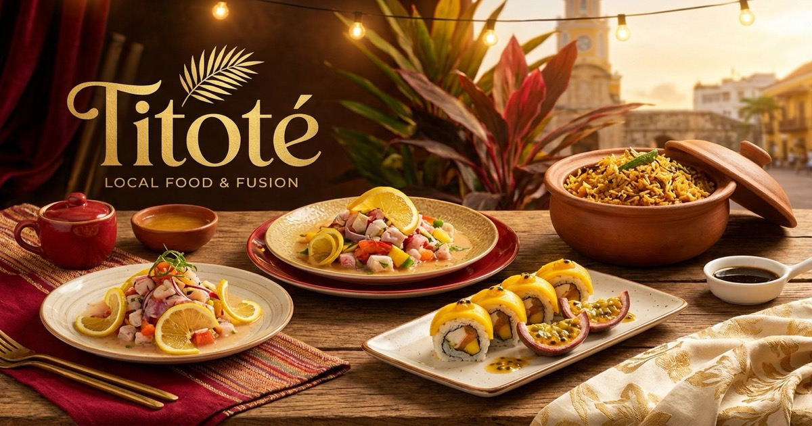

# Titoté Local Food & Fusion 🍽️

Website profesional para Titoté, restaurante de cocina local cartagenera con fusión oriental en Getsemaní, Cartagena.



## ✨ Features

- **🌐 Multi-idioma:** Español e Inglés con cambio en tiempo real
- **📱 Responsive:** Optimizado para móvil, tablet y desktop
- **📅 Sistema de Reservas:** Formulario integrado con WhatsApp
- **🍣 Menú Interactivo:** Navegación por categorías con precios
- **🗺️ Integración Maps:** Ubicación con Google Maps embed
- **💬 WhatsApp Button:** Botón flotante para contacto directo
- **🔍 SEO Optimizado:** Meta tags, Open Graph, JSON-LD structured data
- **⚡ Performance:** Next.js 16 + Turbopack + Tailwind CSS 4

## 🎨 Paleta de Colores

| Color        | Hex       | Uso               |
| ------------ | --------- | ----------------- |
| Verde Oscuro | `#1a4d3e` | Primario, headers |
| Verde        | `#2d6a4f` | Acentos           |
| Verde Claro  | `#40916c` | Hover states      |
| Dorado       | `#c9a227` | CTAs, highlights  |
| Crema        | `#f5f1e6` | Backgrounds       |
| Terracota    | `#c47b5b` | Acentos cálidos   |
| Marrón       | `#5c4033` | Texto, footer     |

## 🚀 Getting Started

```bash
# Instalar dependencias
pnpm install

# Desarrollo
pnpm dev

# Build producción
pnpm build

# Preview producción
pnpm start
```

## 📁 Estructura

```
src/
├── app/
│   ├── layout.tsx      # Layout con SEO metadata
│   ├── page.tsx        # Landing page principal
│   └── globals.css     # Estilos globales + theme
├── components/
│   ├── header.tsx      # Navegación sticky
│   ├── hero.tsx        # Sección hero
│   ├── about.tsx       # Historia del restaurante
│   ├── menu.tsx        # Menú interactivo
│   ├── location.tsx    # Ubicación + mapa
│   ├── reservation.tsx # Formulario de reservas
│   ├── whatsapp-button.tsx # Botón flotante
│   └── footer.tsx      # Footer completo
├── context/
│   └── language-context.tsx # Provider i18n
└── lib/
    ├── i18n.ts         # Traducciones ES/EN
    └── menu-data.ts    # Datos del menú
```

## 📝 Personalización

### Agregar Logo

Reemplaza el texto "Titoté" en `hero.tsx` y `header.tsx` con:

```tsx
<Image src="/images/logo.png" alt="Titoté" width={200} height={80} />
```

### Número de WhatsApp

Busca y reemplaza `573001234567` con el número real del restaurante en:

- `reservation.tsx`
- `whatsapp-button.tsx`

### Imágenes

Agrega las imágenes del restaurante en `/public/images/`:

- `hero-bg.jpg` - Imagen de fondo del hero (1920x1080)
- `og-image.jpg` - Imagen para redes sociales (1200x630)
- Fotos de platos para el menú

### Google Maps

Actualiza las coordenadas exactas en `location.tsx` con el embed correcto de Google Maps.

## 🔧 Tech Stack

- **Framework:** Next.js 16.1.6 (App Router)
- **Styling:** Tailwind CSS 4
- **Language:** TypeScript
- **Testing:** Vitest + Playwright
- **Linting:** ESLint + Prettier

## 📊 SEO Features

- ✅ Meta tags optimizados
- ✅ Open Graph para redes sociales
- ✅ Twitter Card
- ✅ JSON-LD Schema (Restaurant)
- ✅ Sitemap ready
- ✅ Robots.txt ready
- ✅ Canonical URLs
- ✅ Multi-language alternates

## 🚢 Deploy

### Vercel (Recomendado)

```bash
vercel
```

### Netlify

```bash
netlify deploy --prod
```

## 📞 Información del Restaurante

- **Nombre:** Titoté Local Food & Fusion
- **Ubicación:** Calle 29, Getsemaní, Cartagena de Indias
- **Horario:** 12:00 PM - 10:00 PM (todos los días)
- **TripAdvisor:** ⭐ 4.8/5 (#64 en Cartagena)
- **Instagram:** [@titotelocalfood](https://instagram.com/titotelocalfood)
- **Facebook:** [Titoté Local Food](https://facebook.com/titotelocalfood)

---

Made with ❤️ for Titoté
